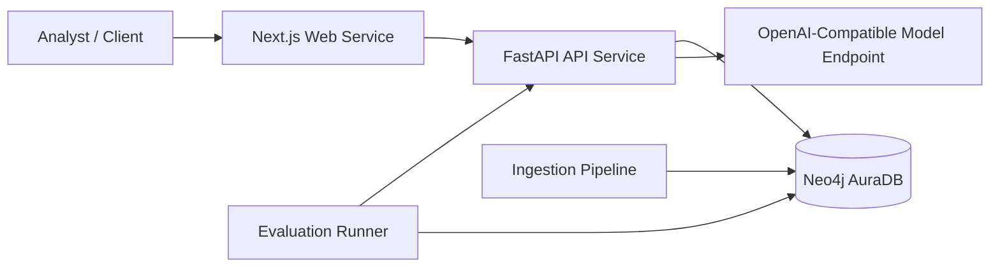
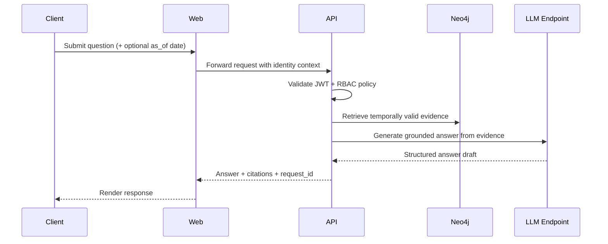
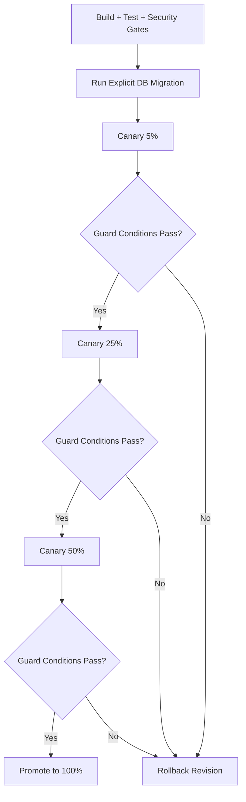

# SAT Graph RAG

## Abstract
SAT Graph RAG is a graph-based retrieval-augmented generation system for temporally constrained analysis of regulatory texts. The system integrates a FastAPI service, a Neo4j knowledge graph, an ingestion pipeline for source material normalization, and a web client for interactive querying. The design objective is to support answer generation with explicit citation grounding and enforceable operational controls.

## Research and Engineering Objectives
- Represent regulatory documents with explicit structural and temporal semantics.
- Retrieve evidence that is both semantically relevant and valid at a specified point in time.
- Generate answers constrained by retrieved evidence and citation validity checks.
- Provide deployment and operations controls suitable for staged production release.

## System Components
- `apps/api`: FastAPI application implementing retrieval, orchestration, and answer generation.
- `apps/web`: Next.js interface for query submission and service health checks.
- `ingest`: ingestion pipeline for document acquisition, parsing, chunking, embedding, and graph persistence.
- `eval`: evaluation runner and fixtures for temporal precision, citation validity, and refusal behavior.
- `apps/api/migrations`: versioned Cypher migrations for graph schema and seed state.

## System Architecture Diagram


## Production Baseline
The repository currently targets the following deployment profile:
- API and web services on Cloud Run.
- Neo4j AuraDB for graph persistence.
- OpenAI-compatible managed model endpoint for inference.
- Containerized ingestion and evaluation jobs executed with workload identity.

Reference documents:
- `docs/architecture.md`
- `docs/operability.md`
- `docs/security.md`
- `docs/deployment-canary.md`
- `docs/observability-local.md`
- `docs/config-profiles.md`
- `docs/runbooks/README.md`

## Local Development Setup
### Prerequisites
- Python 3.11+
- Node.js 20+
- Docker and Docker Compose

### Installation
```bash
cp .env.host.example .env.host
cp .env.docker.example .env.docker
npm install --workspaces
python -m venv venv
venv/Scripts/pip install -r apps/api/requirements-dev.txt
```

### Optional CUDA Acceleration
For local NVIDIA GPUs, install the CUDA-enabled PyTorch overlay:

```bash
venv/Scripts/python -m pip install -r apps/api/requirements-gpu-cu126.txt
```

Then configure embedding execution:
- `EMBED_PROVIDER=hf`
- `EMBED_DEVICE=cuda` (or leave empty for auto-detection)
- `EMBED_BATCH_SIZE=<tuned value>`

For `hf` embeddings, `NEO4J_VECTOR_DIMENSIONS` must match `EMBED_DIM`.
Batch-size tuning can be executed with:

```bash
venv/Scripts/python scripts/benchmark_embedding_batch.py --samples 512 --words-per-sample 220
```

Empirical reference for an RTX 2060 (6 GB) with `BAAI/bge-m3`:
- benchmark date: February 20, 2026
- recommended batch size: `80`

After changing embedding dimensions, run migration reconciliation:

```bash
PYTHONPATH=apps/api venv/Scripts/python -m app.db.migrate
```

### Start dependencies and apply migrations
```bash
docker-compose --env-file .env.docker up -d neo4j
APP_ENV_FILE=.env.host PYTHONPATH=apps/api venv/Scripts/python -m app.db.migrate
```

Optional local observability stack (no GCP dependency):
```bash
API_ENV_FILE=.env.docker docker-compose --env-file .env.docker --profile observability up -d neo4j api prometheus alertmanager grafana
```

### Run API tests and checks
```bash
APP_ENV_FILE=.env.host PYTHONPATH=apps/api venv/Scripts/python -m pytest apps/api/tests
venv/Scripts/python -m ruff check apps/api/app apps/api/tests ingest eval
APP_ENV_FILE=.env.host PYTHONPATH=apps/api venv/Scripts/python -m mypy apps/api/app/core
```

### Run web checks
```bash
npm run --workspace packages/core typecheck
npm run --workspace apps/web typecheck
npm run --workspace packages/core build
npm run --workspace apps/web build
```

## Configuration Model
Configuration is loaded from environment variables and validated at startup. The `.env.example` file provides a complete key set. The following variables govern production-critical behavior:

- Authentication and OIDC:
  - `AUTH_ENABLED`
  - `OIDC_PROVIDER`
  - `OIDC_TENANT_ID`
  - `OIDC_ISSUER`
  - `OIDC_AUDIENCE`
  - `OIDC_JWKS_URL`
  - `OIDC_ROLES_CLAIM`
  - `OIDC_GROUPS_CLAIM`
  - `OIDC_GROUP_ROLE_MAP`
- Rate limiting:
  - `RATE_LIMIT_ENABLED`
  - `RATE_LIMIT_BACKEND` (`memory` or `redis`)
  - `RATE_LIMIT_REDIS_URL`
  - `RATE_LIMIT_WINDOW_SECONDS`
  - `RATE_LIMIT_ROUTE_LIMITS`
  - `RATE_LIMIT_TRUST_PROXY`
  - `RATE_LIMIT_FAIL_OPEN`
- Data and migration:
  - `NEO4J_URI`
  - `NEO4J_USER`
  - `NEO4J_PASSWORD`
  - `AUTO_MIGRATE_ON_STARTUP`

## Security and Authorization
- OIDC JWT verification includes signature, issuer, audience, and tenant validation for Entra profile deployments.
- Canonical RBAC roles are extracted from the `roles` claim.
- Optional fallback mapping from `groups` to RBAC roles is supported through `OIDC_GROUP_ROLE_MAP`.
- Route authorization policy:
  - retrieval and temporal endpoints: `read_only`, `compliance_analyst`, `admin`
  - answer generation endpoints: `compliance_analyst`, `admin`
- Request correlation is enforced through request IDs propagated in logs and response headers.
- Web framework remediation is applied through Next.js `15.5.10`; compensating controls remain enabled to disable image optimization and reject `/_next/image`, `next-action`, and non-read web requests.

## Query Processing Flow Diagram


## Rate Limiting
The API supports two limiter backends:
- in-memory limiter for local development and single-instance execution,
- Redis-backed limiter for shared production enforcement.

Limits are route-aware and may be overridden per endpoint with `RATE_LIMIT_ROUTE_LIMITS`. Client identity derivation supports proxy environments through `X-Forwarded-For` when `RATE_LIMIT_TRUST_PROXY=true`.

## Ingestion Workflow
The ingestion CLI normalizes source documents and writes FRBR-like graph entities.

```bash
python -m ingest run \
  --source_url <source-url> \
  --work_title "Document Title" \
  --jurisdiction EU \
  --authority_level 1 \
  --valid_from 2024-01-01
```

## Evaluation
The evaluation suite uses seeded fixtures and validates:
- temporal precision,
- citation validity,
- refusal rate for advisory prompts.

```bash
PYTHONPATH=apps/api python -m eval run
```

The command requires an accessible Neo4j service (host profile default: `localhost:7687`; Docker profile default: `neo4j:7687`).

## CI
The CI workflow in `.github/workflows/ci.yml` contains:
- Infrastructure job: Terraform formatting and validation (`infra/terraform`).
- API job: lint, type checks, unit tests, and evaluation.
- API dependency security gate: `pip-audit` report plus exception-policy enforcement using `security/pip-audit-exceptions.json`.
- Web security gate: `npm audit --audit-level=critical`.
- Web job: TypeScript checks and production builds.

## Infrastructure as Code
Terraform baseline for Cloud Run deployment is provided under `infra/terraform`.

```bash
cd infra/terraform
terraform init
terraform plan -var-file=environments/staging.tfvars.example
```

## Local Observability
The Docker Compose `observability` profile provisions:
- Prometheus (`http://localhost:9090`)
- Alertmanager (`http://localhost:9093`)
- Grafana (`http://localhost:3001`)

Default Grafana credentials are sourced from `.env.docker`:
- `GRAFANA_ADMIN_USER`
- `GRAFANA_ADMIN_PASSWORD`

Prometheus alert rules are defined in `infra/observability/prometheus/rules/sat_api_alerts.yml`.

External alert routing variables in `.env.docker`:
- `ALERTMANAGER_SLACK_WEBHOOK_URL`
- `ALERTMANAGER_SLACK_CHANNEL`
- `ALERTMANAGER_SLACK_USERNAME`
- `ALERTMANAGER_TEAMS_WEBHOOK_URL`

## Deployment and Rollout
The release model uses explicit migrations and staged canary rollout with rollback guards. The operational policy and thresholds are defined in `docs/deployment-canary.md`.

Canary automation workflow:
- `.github/workflows/canary-gate.yml` evaluates guard thresholds from a metrics JSON payload.
- Optional metric publication writes canary metrics to Cloud Monitoring for Terraform-managed alert policies.

## Release Progression Diagram


## License
This repository is distributed under the MIT License.
