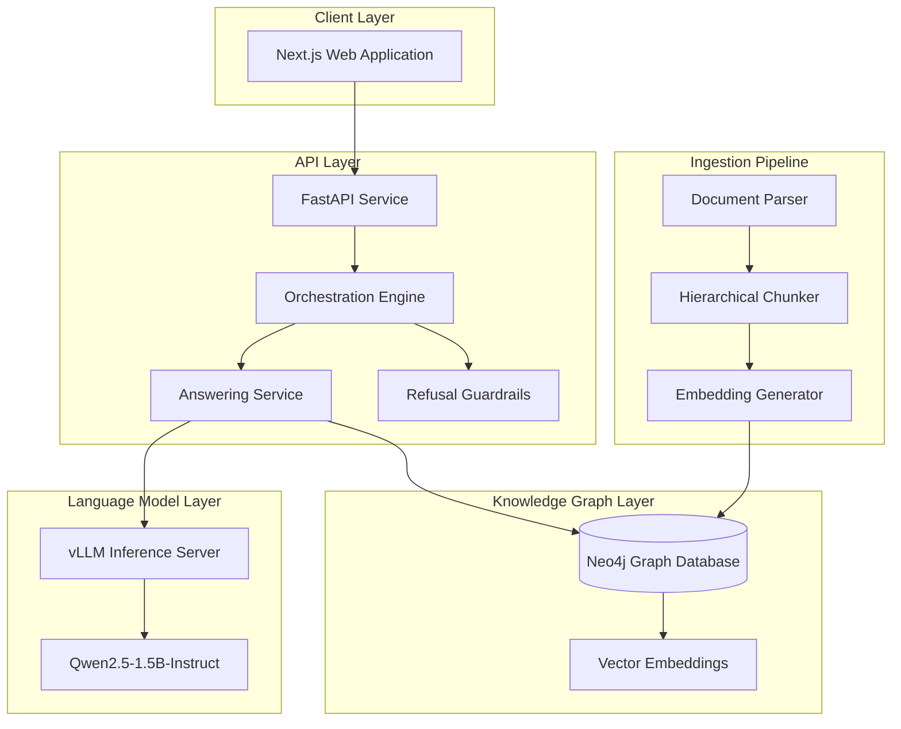
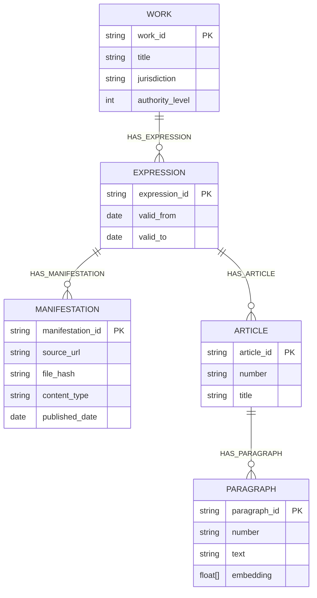
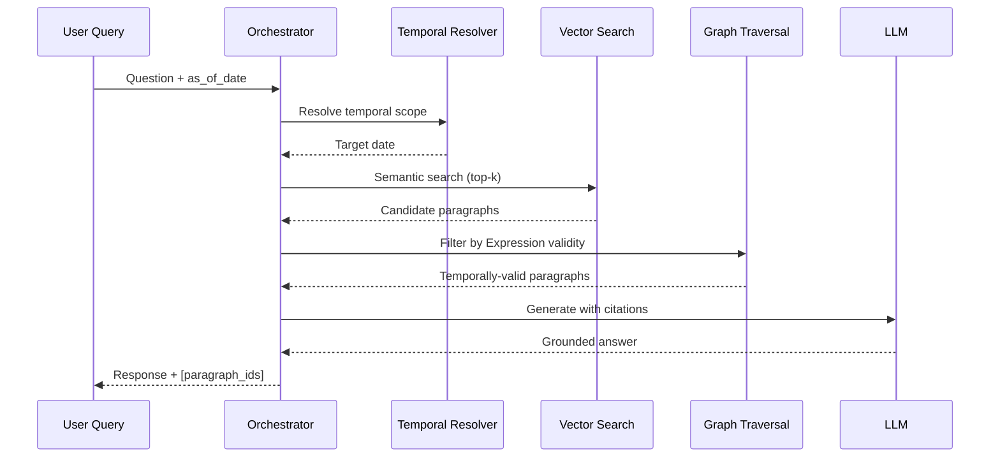

# GraphRAG-EU-Regulations

> **A Graph-based Retrieval-Augmented Generation Framework for Temporal Legal Document Analysis**

[](LICENSE)
[](https://python.org)
[](https://neo4j.com)

## Abstract

This repository presents a novel Graph-based Retrieval-Augmented Generation (GraphRAG) system designed for the semantic analysis and temporal querying of regulatory documents within the European Union legal framework. The system implements the **Functional Requirements for Bibliographic Records (FRBR)** ontology to model hierarchical legal structures, enabling precise version control, temporal validity tracking, and citation-aware question answering.

The architecture addresses three critical challenges in legal AI systems:
1. **Temporal Precision** — Ensuring retrieved content reflects the law as it stood at a specified point in time
2. **Citation Grounding** — Every generated response includes verifiable references to source paragraphs
3. **Adversarial Robustness** — Implementing guardrails to refuse out-of-scope or manipulative queries

---

## System Architecture



---

## FRBR-Based Legal Ontology

The knowledge graph implements the **FRBR (Functional Requirements for Bibliographic Records)** model, adapted for legal documents. This hierarchical structure enables precise temporal versioning and cross-referencing of regulatory texts.



### Ontology Semantics

| Entity | Description | Temporal Scope |
|--------|-------------|----------------|
| **Work** | Abstract legal concept (e.g., GDPR as a regulation) | Permanent identifier |
| **Expression** | Specific version of a Work valid during a time period | `valid_from` → `valid_to` |
| **Manifestation** | Physical representation (PDF, HTML) with integrity hash | Publication date |
| **Article** | Structural unit within an Expression | Inherited from Expression |
| **Paragraph** | Atomic text unit with dense vector embedding | Inherited from Expression |

---

## Retrieval Pipeline

The retrieval mechanism implements a **hybrid search strategy** combining semantic similarity with temporal filtering:



### Key Algorithms

1. **Temporal Scoping**: Queries are resolved against the `valid_from` and `valid_to` bounds of Expressions
2. **Vector Similarity**: Paragraph embeddings enable semantic retrieval via cosine similarity
3. **Citation Extraction**: Responses are validated to ensure all `[paragraph_id]` references exist in the retrieved context

---

## Evaluation Framework

The system includes a rigorous evaluation suite measuring three core metrics:

| Metric | Threshold | Description |
|--------|-----------|-------------|
| **Temporal Precision** | ≥ 1.00 | Retrieved paragraphs must belong to the correct temporal Expression |
| **Citation Accuracy** | ≥ 1.00 | All citations in generated answers must reference retrieved paragraphs |
| **Refusal Rate** | > 0.95 | Adversarial/out-of-scope queries must be refused |

```bash
# Execute evaluation suite
python -m eval run
```

---

## Project Structure

```
├── apps/
│   ├── api/                    # FastAPI backend service
│   │   ├── app/
│   │   │   ├── api/            # REST endpoint definitions
│   │   │   ├── core/           # Configuration and settings
│   │   │   ├── db/             # Neo4j connection and schema
│   │   │   └── services/       # Business logic
│   │   │       ├── actions.py      # Search and retrieval
│   │   │       ├── answering.py    # LLM-based generation
│   │   │       ├── orchestration.py# Query coordination
│   │   │       └── refusal.py      # Guardrail implementation
│   │   └── migrations/         # Database schema migrations
│   └── web/                    # Next.js frontend application
├── ingest/                     # Document ingestion pipeline
│   ├── pipeline.py             # Main orchestration
│   ├── chunking.py             # Article/paragraph extraction
│   ├── embeddings.py           # Vector embedding generation
│   └── parsers.py              # Document format parsers
├── eval/                       # Evaluation framework
│   ├── runner.py               # Test execution engine
│   └── fixtures/               # Gold-standard test cases
├── packages/
│   └── core/                   # Shared TypeScript utilities
└── docker-compose.yml          # Container orchestration
```

---

## Deployment

### Prerequisites

- Docker & Docker Compose
- NVIDIA GPU with CUDA support (for vLLM inference)
- Python 3.11+

### Quick Start

```bash
# Clone repository
git clone https://github.com/<your-username>/graphrag-eu-regulations.git
cd graphrag-eu-regulations

# Configure environment
cp .env.example .env
# Edit .env with your Neo4j credentials and API keys

# Launch services
docker-compose up -d

# Ingest sample regulations
python -m ingest --source <regulation-url> --title "Sample Regulation"

# Access application
# Web UI: http://localhost:3000
# API:    http://localhost:8000/docs
```

---

## Technical Specifications

| Component | Technology | Purpose |
|-----------|------------|---------|
| **Graph Database** | Neo4j 5.21 | FRBR ontology storage, Cypher queries |
| **Vector Index** | Neo4j native embeddings | Semantic similarity search |
| **LLM Inference** | vLLM + Qwen2.5-1.5B-Instruct | Answer generation |
| **Backend API** | FastAPI (Python 3.11) | RESTful service layer |
| **Frontend** | Next.js | User interface |
| **Containerization** | Docker Compose | Service orchestration |

---

## Research Applications

This framework is designed to support research in:

- **Legal Information Retrieval**: Temporal-aware document search
- **Explainable AI for Law**: Citation-grounded answer generation
- **Regulatory Compliance**: Automated policy interpretation
- **Knowledge Graph Construction**: FRBR-based legal ontology engineering


---

## License

This project is licensed under the MIT License — see [LICENSE](LICENSE) for details.

---

## Contributing

Contributions are welcome. Please open an issue to discuss proposed changes before submitting a pull request.
